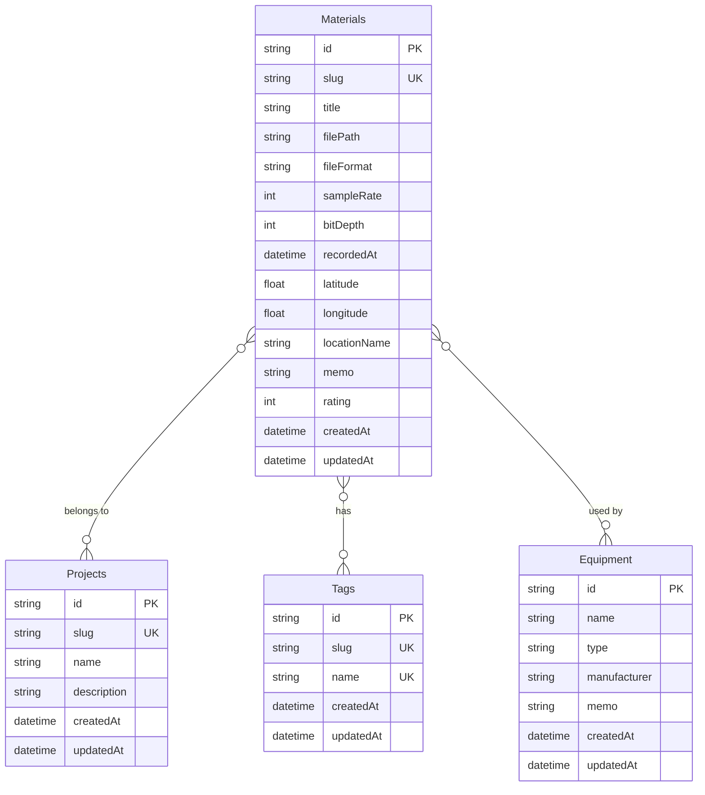

# データベース設計（完全版）

このドキュメントは、アプリケーションで必要となるデータの最終的な構造を定義するものです。

---

### 1. 素材テーブル (Materials)
録音した音声ファイルそのものと、それに付随する全ての情報を格納する、このツールの中心となるテーブルです。

-   **id** (文字列): システム内で一意に素材を識別するためのID [主キー, UUID/CUID形式]
-   **slug** (テキスト): URLで使用する、人間が読めるエイリアス [重複不可]
-   **title** (テキスト): 素材のタイトル [必須]
-   **filePath** (テキスト): サーバー内に保存された音声ファイルのパス [必須]
-   **fileFormat** (テキスト): ファイル形式 (例: "WAV", "MP3")
-   **sampleRate** (数値): サンプリングレート (例: 48000)
-   **bitDepth** (数値): ビット深度 (例: 24)
-   **recordedAt** (日時): 録音された日時 [必須]
-   **latitude** (数値): 録音場所の緯度 [任意]
-   **longitude** (数値): 録音場所の経度 [任意]
-   **locationName** (テキスト): 録音場所の名称 (例: "代々木公園") [任意]
-   **memo** (長文テキスト): 状況や感想などを記録する自由なメモ [任意]
-   **rating** (数値): 1〜5段階のお気に入り度 [任意]
-   **createdAt** (日時): このデータが作成された日時
-   **updatedAt** (日時): このデータが最後に更新された日時

---

### 2. プロジェクトテーブル (Projects)
複数の素材をまとめる「アルバム」や「フォルダ」のような役割を持つテーブルです。

-   **id** (文字列): プロジェクトを一意に識別するためのID [主キー, UUID/CUID形式]
-   **slug** (テキスト): URLで使用する、人間が読めるエイリアス [重複不可]
-   **name** (テキスト): プロジェクト名 [必須]
-   **description** (長文テキスト): プロジェクトの説明 [任意]
-   **createdAt** (日時): このデータが作成された日時
-   **updatedAt** (日時): このデータが最後に更新された日時

---

### 3. タグテーブル (Tags)
素材を分類・検索するために使われるタグ情報を管理するテーブルです。

-   **id** (文字列): タグを一意に識別するためのID [主キー, UUID/CUID形式]
-   **slug** (テキスト): URLで使用する、人間が読めるエイリアス [重複不可]
-   **name** (テキスト): タグ名 (例: "自然音", "雨") [必須, 重複不可]
-   **createdAt** (日時): このデータが作成された日時
-   **updatedAt** (日時): このデータが最後に更新された日時

---

### 4. 機材テーブル (Equipment)
録音に使用した機材の情報をマスタデータとして管理するテーブルです。

-   **id** (文字列): 機材を一意に識別するためのID [主キー, UUID/CUID形式]
-   **name** (テキスト): 機材名 (例: "Zoom H5") [必須]
-   **type** (テキスト): 機材の種類 (例: "レコーダー", "マイク") [必須]
-   **manufacturer** (テキスト): メーカー名 (例: "Zoom") [任意]
-   **memo** (長文テキスト): 機材に関するメモ [任意]
-   **createdAt** (日時): このデータが作成された日時
-   **updatedAt** (日時): このデータが最後に更新された日時

---

### 5. テーブル間の関係（リレーション）

-   **素材とプロジェクトの関係 (多対多)**
    -   1つの素材は、複数のプロジェクトに所属できます。
    -   1つのプロジェクトは、多数の素材を持つことができます。
    -   （実装上は、`Material`と`Project`をつなぐための中間テーブルが作成されます）

-   **素材とタグの関係 (多対多)**
    -   1つの素材には、複数のタグを付けることができます。
    -   1つのタグは、複数の素材に使用することができます。
    -   （実装上は、`Material`と`Tag`をつなぐための中間テーブルが作成されます）

-   **素材と機材の関係 (多対多)**
    -   1つの素材（録音）には、複数の機材（例: レコーダー1台とマイク1本）を紐付けることができます。
    -   1つの機材は、複数の素材（録音）で使用することができます。
    -   （実装上は、`Material`と`Equipment`をつなぐための中間テーブルが作成されます）
-   

